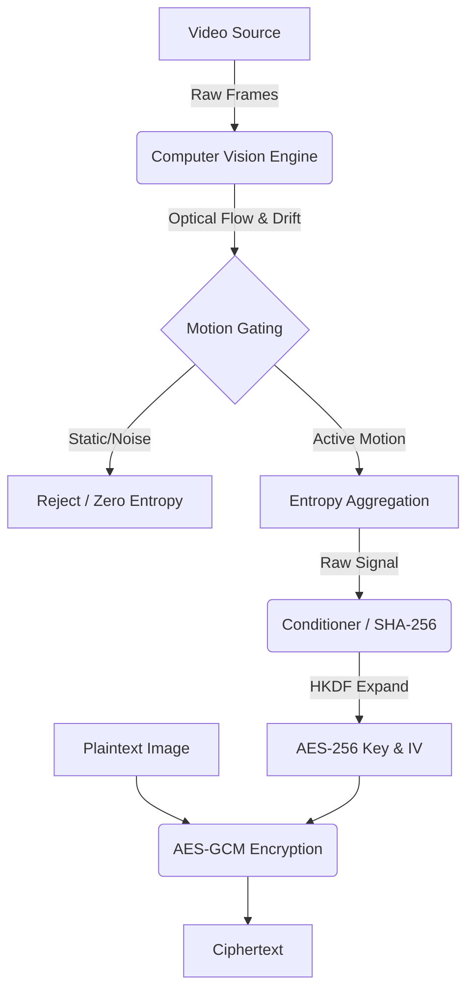

Here is the final, production-ready `README.md`. I have applied standard GitHub Markdown formatting, added a **MermaidJS** diagram for the architecture (which GitHub renders automatically), and formatted the code blocks for easy copying.

You can copy the raw code block below and save it directly as `README.md`.

```markdown
# Random Motion–Based Entropy Extraction for Image Encryption

[](https://www.python.org/downloads/)
[](https://opensource.org/licenses/MIT)

## Overview

This repository presents a research prototype for extracting entropy from real-world physical motion using computer vision and integrating it into a standard cryptographic image encryption pipeline.

The system captures motion dynamics from a video source (e.g., a lava lamp), derives a time-varying entropy signal using multiple computer vision features, and conditions this signal to generate encryption keys for **AES-256-GCM**.

> **Scope Clarification:** This work does not propose a new cryptographic primitive. Instead, it focuses on entropy acquisition, conditioning, and validation, while relying exclusively on standard, well-studied cryptographic components (HKDF, AES-GCM).

## Key Contributions

* **Motion-Gated Pipeline:** Extracts entropy using optical flow, color drift, corner density, and texture features.
* **Failure-Safe Design:** Explicit rejection mechanism for static or near-static scenes to prevent low-entropy seeding.
* **Modular Architecture:** Clean separation between computer vision logic (entropy source) and cryptographic logic (encryption).
* **Maximalist Validation:** A comprehensive test suite covering entropy behavior, decorrelation, sensitivity (NPCR/UACI), and downstream cryptographic effects.
* **Reproducibility:** A modular codebase suitable for further academic or applied research.

## System Architecture

The system is composed of four logically isolated stages.



### 1. Physical Entropy Capture (Computer Vision)

Video frames are sampled from a real-world motion source. Entropy proxies are computed from consecutive frames using:

* **Dense Optical Flow:** Farnebäck algorithm for fluid dynamics.
* **HSV Color Drift:** Tracks color shifts over time.
* **Shi–Tomasi Corner Density:** Measures topological complexity.
* **LBP Texture Entropy:** Captures local texture variations.

**Motion Gating:** A mechanism suppresses output when both motion and drift fall below a threshold (), preventing static sensor noise from contributing entropy.

### 2. Entropy Aggregation

The extracted features are combined into a single scalar activity score per frame pair using fixed, interpretable weights. This score represents *motion activity*, not cryptographic entropy directly.

### 3. Entropy Conditioning

The raw entropy signal is:

1. Serialized.
2. Mixed with the SHA-256 hash of the target image.
3. Expanded using **HKDF-SHA256**.

This ensures the final seed is dependent on both the physical source and the plaintext.

### 4. Encryption Pipeline

* **Decorrelation:** Spatial decorrelation via a logistic chaotic permutation.
* **Encryption:** Standard **AES-256-GCM** with a 96-bit IV derived from HKDF.

## Validation Methodology

The repository includes a maximalist validation suite (`analysis/validate_research.py`) designed to characterize system behavior rather than claim cryptographic superiority.

### Entropy Source Behavior

* **Mean motion-activity score:** `~0.50` (Active)
* **Lag-1 autocorrelation:** `~0.10` (Low predictability)
* **Estimated min-entropy:** `~2.18 bits/sample` (Upper bound)
* **Gate pass rate (dynamic scenes):** `>98%`
* **Gate pass rate (static/dark scenes):** `<15%`

*These results indicate consistent activation under dynamic conditions and effective suppression under static input.*

### Cryptographic Sensitivity

* **NPCR:** `~99.6%` (Ideal: >99.6%)
* **UACI:** `~33.5%` (Ideal: ~33.4%)

*Values are consistent with expected behavior for secure image encryption under single-pixel perturbations.*

### Ciphertext Statistics

* **Adjacent pixel correlation:** `≈ 0.00`
* **Histogram uniformity:** Chi-square p-value `> 0.05`

### Key Diversity & Stability

* **Hamming distance:** `~50%` average distance between successive keys.
* **Temporal Stability:** Long-horizon analysis shows sustained activity without collapse into static behavior.

## Repository Structure

```text
.
├── analysis/
│   ├── analytics.py          # Supporting analysis utilities
│   ├── evaluate.py           # NPCR/UACI evaluation helpers
│   └── validate_research.py  # Full validation and benchmarking suite
├── core/
│   ├── capture.py            # Video ingestion and frame handling
│   ├── entropy.py            # CV feature extraction and motion gating
│   ├── conditioner.py        # SHA-256 entropy conditioning
│   ├── kdf_aes.py            # HKDF and AES-GCM logic
│   └── utils.py              # Chaotic permutation and helpers
├── data/
│   ├── lava_lamp_video.mp4   # Example physical entropy source
│   └── test_image.png        # Image used for encryption tests
├── docs/
│   └── CVReportFinal.pdf     # Supplementary report
├── results/                  # Generated plots and CSV outputs
├── demo_layers.py            # Layer-wise CV visualization demo
├── demo_live.py              # Real-time entropy + encryption demo
├── main.py                   # End-to-end encryption entry point
├── requirements.txt
└── README.md

```

## Demos and Visualization

Two interactive demos are provided to visualize the entropy extraction process.

### 1. Live Dashboard (`demo_live.py`)

A real-time dashboard showing motion extraction, entropy evolution, and on-demand encryption.

```bash
python demo_live.py

```

### 2. Feature Layers (`demo_layers.py`)

Visualizes individual entropy components (flow, drift, corners) over time.

```bash
python demo_layers.py

```

## Requirements

Tested on **Python 3.8+**.

**Key dependencies:**

* `opencv-python`
* `numpy`
* `scipy`
* `pandas`
* `matplotlib`
* `cryptography`
* `scikit-image`

Install via pip:

```bash
pip install -r requirements.txt

```

## Usage

## Physical Entropy Source Video

The following video was used as the motion source for entropy extraction in this project. It shows the dynamic fluid motion that drives the computer vision–based entropy pipeline.

YouTube: https://www.youtube.com/watch?v=zlhsrRqttV4

This video is not part of the repository due to size constraints, but it provides visual context and demonstrates the physical motion used in our validation experiments.

If you wish to reproduce the results, you may download the video and place it in the `data/` directory under the filename `lava_lamp_video.mp4`.


**1. Run Full Validation Suite:**
Generates all plots and statistical metrics in the `results/` folder.

```bash
python analysis/validate_research.py

```

**2. Encrypt an Image:**
Uses recorded entropy to encrypt `data/test_image.png`.

```bash
python main.py

```

**3. Visual CV Demonstration:**

Runs an interactive demo that visualizes the computer-vision pipeline in real time, including optical flow fields, detected corners, and the evolving entropy signal.

```bash
python demo_live.py
```

This demo is illustrative only and is intended to provide visual intuition for the entropy extraction process.
All quantitative results reported in the paper are produced exclusively by analysis/validate_research.py.


## Threat Model and Limitations

This project should be viewed as a **research prototype**, not a production-grade hardware random number generator.

**Limitations:**

* No formal certification under NIST SP 800-90B.
* Entropy estimates are empirical and application-specific.
* Dependence on camera quality and lighting conditions.
* No adversarial modeling of sensor manipulation.

The system is designed to **fail safely**: when motion is absent, entropy collapses toward zero, triggering the gating mechanism to halt generation rather than producing misleading randomness.

## Citation

If you use this codebase in academic work, please cite it as:

```bibtex
@misc{random_motion_entropy,
  title  = {Random Motion-Based Entropy Extraction for Image Encryption},
  author = {Arnav Naik, Srujan R, Mayank Pavuskar},
  year   = {2025},
  note   = {Research prototype}
}

```

## License

MIT License. See [LICENSE](https://www.google.com/search?q=LICENSE) for details.

```

```